# PORTING TinyUSB USBTMC SOFT-STACK TO ATSAMD21

## USBTMC
USBTMC is a USB class that stands for USB Test and Measurement Class. It allows GPIB-style communication over USB using USBTMC-compliant VISA layers. 

USBTMC is a USB wrapper for GPIB (IEEE488) protocol and is the standard USB communication protocol for benchtop equipment and instrumentation. USBTMC allows for SCPI style commands as well as custom or free-form commands. USBTMC can operate up to 12Mb/s making the communication speed and robustness superior to RS232. The TinyUSB stack has minimal code space overhead making it ideal for resource constrained devices.

## Getting Started
TinyUSB was developed in a Linux OS with the stack being agnostic to the hardware. TinyUSB uses a web of nested make files and builds the firmware and binaries from the command line. An issue you may run into is that the TinyUSB directory structure, supported MCUs, BSPs, and examples makes it bloated and difficult to port, especially if you want to add USB to an existing project in a specific IDE. 

1. Hardware Requirements
    - ATSAMD21-Xplained-Pro
    - Qty 2: Micro USB Cables
    - Scope or Logic Analyzer

2. Software Requirements
    - [MSYS2 (Linux Emulator for Windows)](https://www.msys2.org/)
    - [Microchip Studio](https://www.microchip.com/en-us/tools-resources/develop/microchip-studio)
    - [NI Max](https://knowledge.ni.com/KnowledgeArticleDetails?id=kA03q000000YGQwCAO&l=en-US) or [Python](https://www.python.org/downloads/release/python-3110/)

3. Install MSYS2 Packages for the build
    - Open MSYS2
    - In the MSYS2 command prompt type: `pacman -S git`
    - In the MSYS2 command prompt type: `pacman -S make`
    - In the MSYS2 command prompt type: `pacman -S gcc`
    - In the MSYS2 command prompt type: `pacman -S mingw-w64-x86_64-arm-none-eabi-toolchain`
    - Add the arm toolchain to the PATH with the following two commands:
    - `echo "export PATH=$PATH:/mingw64/bin" >> ~/.bashrc`
    - `source ~/.bashrc`

4. Download the TinyUSB Stack 
    - In MSYS2 navigate to a directory where you want the TinyUSB stack to live such as *c/documents/code/thirdparty*
    - type: `git clone https://github.com/hathach/tinyusb tinyusb`
    - type: `cd tinyusb`
    - type: `git submodule update --init lib`

5. Build the ATSAMD21-Xplained-Pro USBTMC Example
    - Navigate to the examples folder `cd examples/device/usbtmc`
    - Now we need to import the samd21 low level driver support using the command: `make BOARD=atsamd21_xpro get-deps`
    - Now we need to build the USB stack on top of the low level drivers. TinyUSB has made this very easy with the command: `make BOARD=atsamd21_xpro all`

6. Flash the USBTMC Example Firmware
    - Connect a micro usb cable from your PC to the Debug USB port on the SAMD development board
    - Connect a micro usb cable from your PC to the Target USB port on the SAMD development board
    - Open Microchip studio and click the 'device programming' button 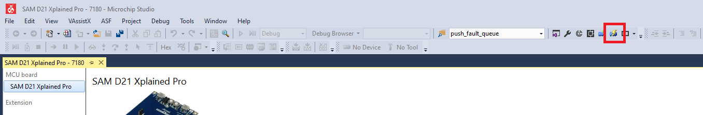
    - Select the programmer, device, interface. Read device signature, select memories, find the 'usbtmc.elf' file, and program. The elf file can be found here: *c/../tinyusb/examples/device/usbtmc/_build/atsamd21_xpro/usbtmc.elf* 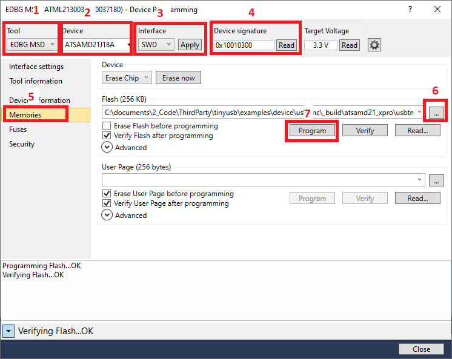
    - If you run into compilation issues, you can use the pre-compiled usbtmc.elf file to flash onto the board. It can be found on the [git repo](https://github.com/ResearchElectro-Optics/FW_USBTMC.git) in the ./SAMD21_Example_Exe/ directory.

7. Confirm the TinyUSB Device Enumerates
    - Open NI Max
    - Click the 'Devices and Interfaces' drop down. 
    - A usb device called '*TinyUSB Device "USB::0xCAFE::0x4000::123456::INSTR"*' should be  available
    - Open a VISA test panel and send a *IDN? query. You should recieve back the following text "*TinyUSB,ModelNumber,SerialNumber,FirmwareVer123456\r\n*" 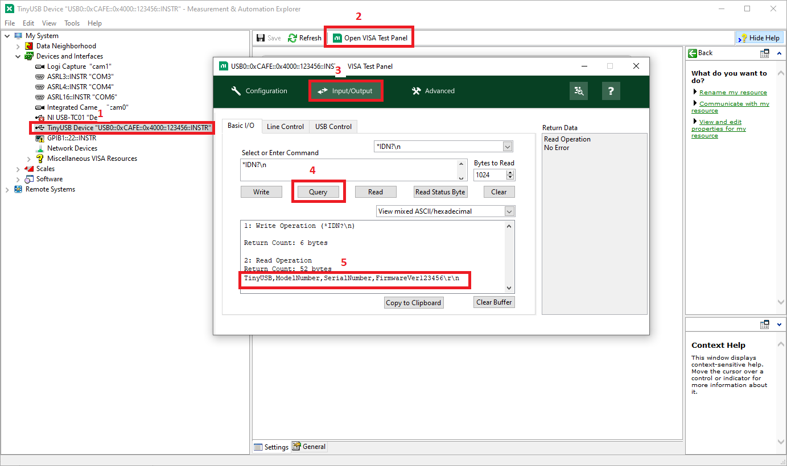
    - You could also use the python file 'visaQuery.py' on the [git repo](https://github.com/ResearchElectro-Optics/FW_USBTMC.git) for testing. Call `python visaQuery.py` from the command line. The python scrip will find the USBTMC device and perform a successful *IDN? query. 
    - Hook up a scope probe to PA19 on the ATSAMD21 dev board. The output should be a square wave, 50% duty, and 500Hz. This PWM signal is derived from the 48MHz USB clock. If the 48MHz clock is not derived correctly the frequency of this signal won't be the expected 500Hz. 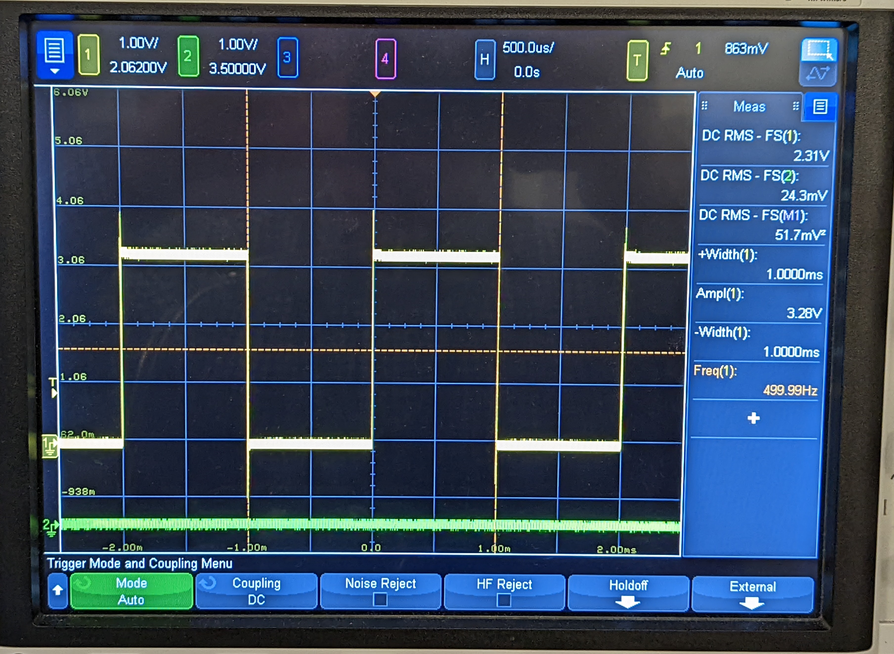

## Porting TinyUSB USBTMC Stack to Atmel Start Project
At this point you have succesfully compiled, flashed, and communicated with the SAMD21 using the TinyUSB stack and example code. Now we need to port the usb stack to a project. 

1. Open Microchip studio and select file -> new -> atmel start project. You should target either the ATSAMD21J18A-AU chip or the ATSAMD21 Xplained Pro board. 
2. Atmel Start Clock Configurator
    - Atmel Start and the generated ASF4 drivers are notoriously horrid at doing their job. So we are going to setup the clock tree to feed to correct generic clock generators to the component drivers, but we will actually write directly to the clock registers to setup the clocks. This is because I could not get ASF to output a compliant USB clock. Your Atmel start clock tree should match the clock diagram below: 
    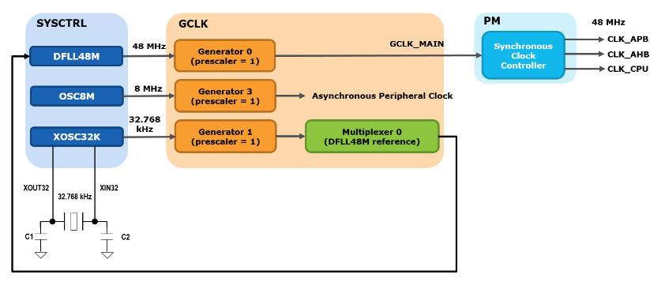
    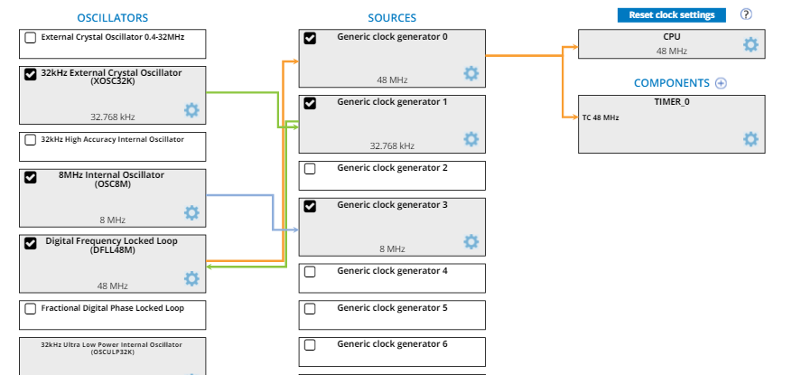
3. Device Drivers, Middleware, & PinMux
    - From the Atmel Start Dashboard select whatever device drivers or middleware is required for the project. Select the correct clock generator to feed the drivers when setting them up (32kHz, 8MHz, 48MHz)
    - Do not select USB component drivers or middleware. This gets setup within the tinyusb stack in the *dcd_samd.c* file
    - Setup the Pinmux to suit your project needs
4. Generate the project
5. Setup the TinyUSB directory 
    - Create a folder within the project directory called *tinyusb*. The directory structure should look like this:  
<pre>
    tinyusb  
       ├── hw  
       │    ├── bsp  
       │    │   ├── samd21  
       │    │   │   ├── board.h (formally in ../boards/atsamd21_xpro) 
       │    │   │   ├── family.c
       │    │   │   ├── clock_defs.h (this file doesn't exist yet)
       │    │   │   ├── clock_init.h (this file doesn't exist yet) 
       │    │   │   └── clock_init.c (this file doesn't exist yet) 
       │    │   ├── ansi_escape.h 
       │    │   ├── board.c  
       │    │   ├── board.h  
       │    │   └── board_mcu.h  
       │    ├── main.c (formally in ../examples/device/usbtmc/src) 
       │    ├── main.h (formally in ../examples/device/usbtmc/src) 
       │    ├── tusb_config.h (formally in ../examples/device/usbtmc/src) 
       │    ├── usb_descriptors.c (formally in ../examples/device/usbtmc/src)  
       │    ├── usbtmc_app.c (formally in ../examples/device/usbtmc/src) 
       │    └── usbtmc_app.h (formally in ../examples/device/usbtmc/src) 
       └── src (This directory should remain unchanged except for the 'portable' folder) 
            ├── class
            ├── common
            ├── device
            ├── host
            ├── osal
            ├── portable
            │   ├── dcd_samd.c (Keep this file. Delete everything else)  
            ├── tusb.c
            ├── tusb.h
            └── tusb_option.h    
</pre>

6. Adding the clock files
    - There are three files shown in the directory tree above that "do not exist yet". 
    - You can get these files from the [git repo](https://github.com/ResearchElectro-Optics/FW_USBTMC.git) *../Modified_TinyUSB_Stack/tinyusb/hw/bsp/samd21*
    - These files create a 48MHz clock from the 32kHz external slow clock. It also outputs the 8MHz internal oscillator to a generic clock generator. See the clock diagram above. 
7. Add TinyUSB to Microchip Studio Project
    - Put the TinyUSB directory we just modified into the directory where source files are kept for the Atmel project e.g. *c/../documents/code/embedded/usbtmc_tinyusb/*
    - click the 'show all files button' in the solution expolorer
    - A grayed out tinyusb directory should appear. Right click on the tinyusb folder and select 'Include In Project'
    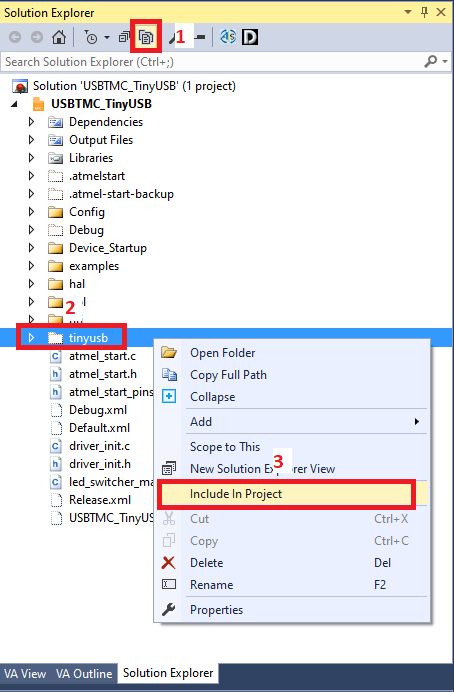
    - We need to tell Microchip studio where to look for these files during compliation. From the Microchip Studio toolbar select Project -> \<Project Name\> Properties
    - From the properties window select *toolchain -> Directories* then add each sub-directory in the tinyusb file structure. 
    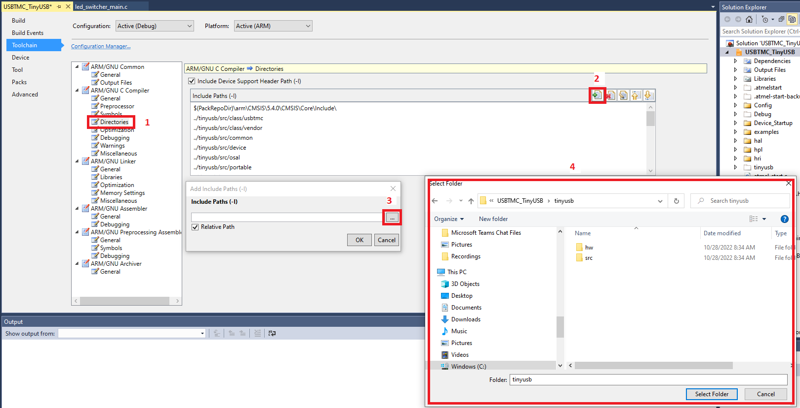

8. Options & Modifications needed to Compile
    - The atmel project has been created and the modified USB stack has been added along with addtional dependency directories. Before we compile, we have to make a few modifications to the generated code and USB stack. 
    1. In the tinyusb stack open the file 'tusb_config.h'. Add the line `#define CFG_TUSB_MCU OPT_MCU_SAMD21` on line 34
    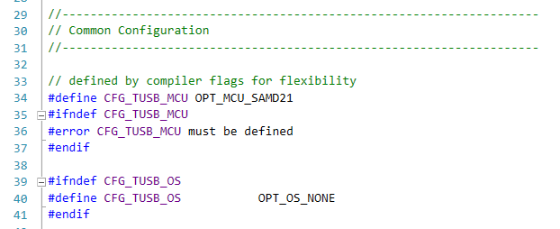
    2. Copy main.c file from tinyusb, sans the #includes, and paste it into the main.c file generated by atmel studio
    3. Comment out the entire tinyusb main.c file with /* */ or remove the file from the project
    4. In the main.c file generated by Microchip Studio, add the following includes:
        - `#include "tinyusb/hw/bsp/board.h"`
        - `#include "tusb.h"`
        - `#include "usbtmc_app.h"`
    5. In the 'family.c' file in the tinyusb stack:
        - add `#include "atmel_start_pins.h"`
        - add `#include "clock_defs.h"`
        - add `#include "clock_init.h"`
        - add `clock_init();` as the first call in the 'board_init()' function
        - comment out the original clock init code
        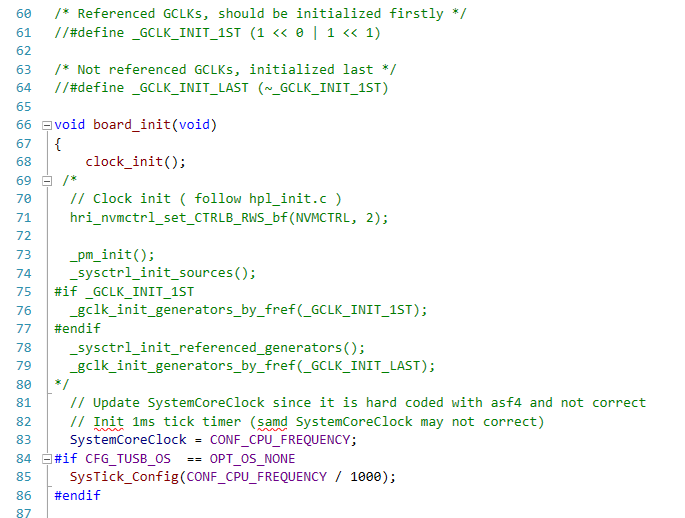
    6. In the microchip generated main.c file
        - add the function `atmel_start_init();` after `board_inint();`  
        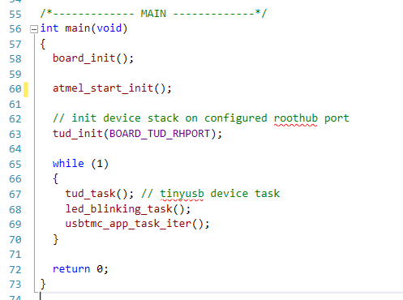
        - in the file 'driver_init.c' comment out the line `init_mcu();`. This function will cause a clock config tug-of-war and destroy the clock tree  
        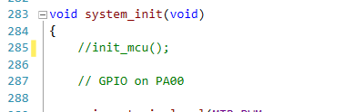  

    - You are now at a point where the code should compile successfully. You can flash the board and the USB device will properly enumerate. 
  
9. USB Device Descriptors  
When a USB device enumerates to the host it sends *descriptors* to communicate what the device is. You can modify these descriptors in the 'usb_descriptors.c' file. For USBTMC those descriptors include 
    - VID : Vendor ID
    - PID : Product ID
    - BCD : USB Version (e.g. 0x0200 == USB 2.0)
    - String Descriptors:
        - Manufacture Name
        - Product Name
        - Product Serial Number
        - Optional Descriptor (e.g. USB Protocol such as USBTMC) 

10. Example Code
    - All the modified code including the tinyusb stack, microchip studio example, and compiled tinyusb examples are on the [git repo](https://github.com/johnpetrilli90/TinyUSB_Port.git) if you run into issues or need to reference a working example. 

11. References
    - https://docs.tinyusb.org/en/latest/reference/getting_started.html
    - https://docs.tinyusb.org/en/latest/contributing/porting.html
    - https://github.com/hathach/tinyusb
    - https://github.com/charkster/samd21-usbtmc

 

    

